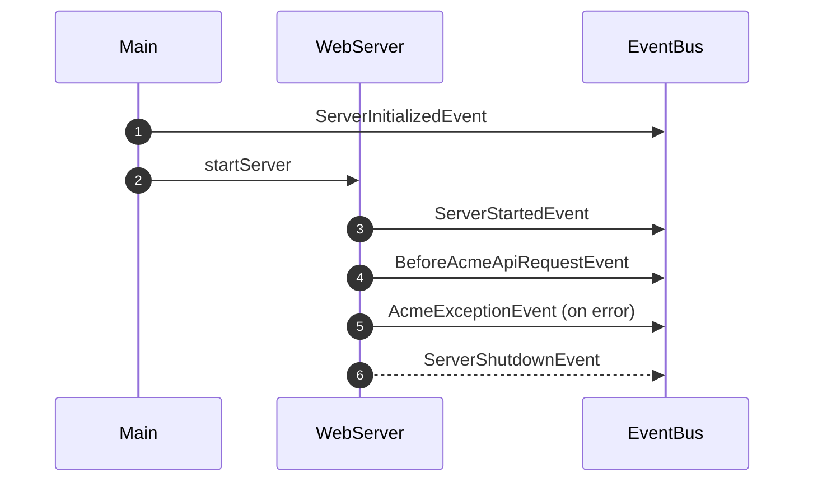
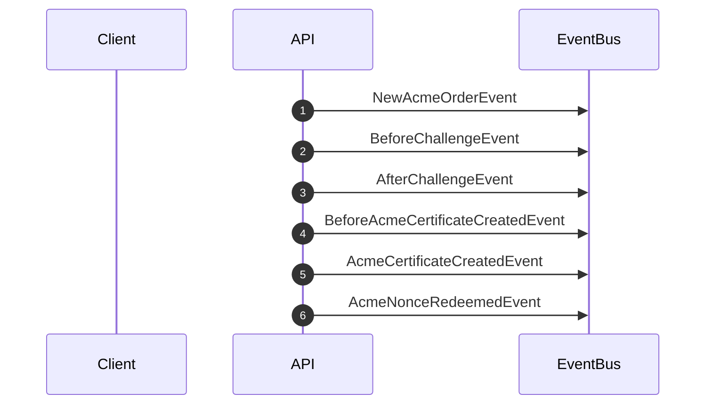

# Event Bus Flow

This document explains how lifecycle and ACME events are emitted by the server. The diagram below shows the typical order in which events are published.

For ACME operations an order similar to the following is used:

Each event is dispatched to all registered listeners via the server instance's `EventBus`.
